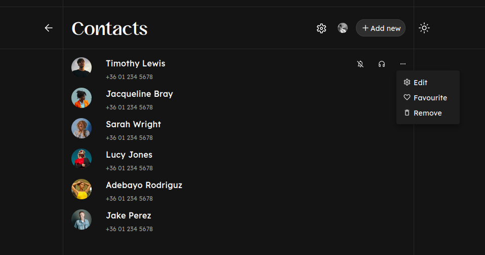
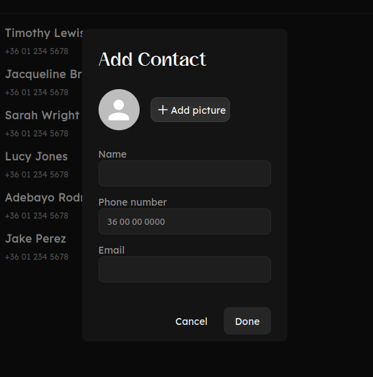
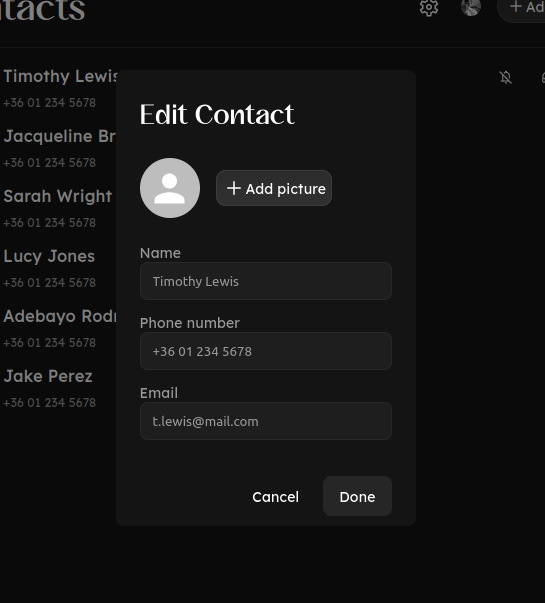

# Tech stack

typescript // Next.js // MUI // Prisma // SQLite // s3

# Add, remove, edit contacts







# Getting Started

### Clone the github repository to your local machine

### Install dependencies
	npm install

	or
	
	yarn install
	
### Set up s3 connection
Modify the provided .example.env file and set up necessary environment variables:
	
AWS_ACCESS_KEY="your_key"

AWS_SECRET_KEY="your key"

**Don't forget to rename it to .env!**

Change credentials to match your own in the **s3.ts** file, including region, bucket name and the constant part of the url for the uploaded images.

### Set up Prisma
	npx prisma migrate reset

### Run the development server

```bash
npm run dev
# or
yarn dev
# or
pnpm dev
# or
bun dev
```

### Finally
Open [http://localhost:3000](http://localhost:3000) with your browser to see the result.

### TODO
1. Image upload to s3 bucket outside of the initial seed file doesn't work, so in the *Add contact* and *Edit contact* dialogs you can only upload pictures temporarily to the DOM. 
3. Writing tests (e.g. with Cypress or something similar).
4. Deployment.
